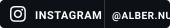
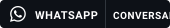

<!-- CABEÇALHO E BIO -->
<table width="100%" style="border: none; border-collapse: collapse;">
<tr>
<!-- Coluna de Texto -->
<td width="70%" valign="top" style="border: none;">

Seja bem-vindo(a) ao meu perfil >_

<!-- Nome com Animação -->
<h1 style="margin-bottom: 0; border-bottom: none;">

</h1>

<!-- Subtítulo -->
<h3 style="font-family: monospace; color: #58A6FF; font-weight: normal; margin-top: 0px;">
Development • Full Stack • IA _
</h3>

<!-- Descrição -->

Formado em Ciência de Dados e graduando em Ciência da Computação. 
Sou cofundador da Neurohub e atuo na construção da base técnica, UI/UX e as automações que garantem o funcionamento ágil de toda a plataforma, desenvolvendo soluções em dados, software e tecnologia. 

 

<!-- Redes Sociais (Empilhadas e Monocromáticas) -->

<!-- Coluna do Grafismo -->
<td width="30%" align="center" valign="middle" style="border: none;">

  
  
<!-- Botão da Neurohub com a imagem solicitada -->

</td>
</tr>
</table>

 

 

  &nbsp;&nbsp;&nbsp;&nbsp;
  &nbsp;&nbsp;&nbsp;&nbsp;
  &nbsp;&nbsp;&nbsp;&nbsp;
  &nbsp;&nbsp;&nbsp;&nbsp;
  &nbsp;&nbsp;&nbsp;&nbsp;
  &nbsp;&nbsp;&nbsp;&nbsp;
  &nbsp;&nbsp;&nbsp;&nbsp;
  

<!-- SEÇÃO ATUALMENTE -->
<h3 style="font-family: monospace; color: #8B949E; font-weight: normal; text-transform: uppercase;">
🧠 Atualmente
</h3>

&nbsp;&nbsp;[ / ]&nbsp;&nbsp;Desenvolvimento Web e Mobile 
&nbsp;&nbsp;[ &gt; ]&nbsp;&nbsp;Automações 
&nbsp;&nbsp;[ # ]&nbsp;&nbsp;Projetos da Neurohub 
&nbsp;&nbsp;[ % ]&nbsp;&nbsp;Análise de Dados

