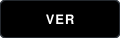

<!-- CABEÇALHO E BIO -->
<table width="100%" style="border: none; border-collapse: collapse;">
<tr>
<!-- Coluna de Texto -->
<td width="70%" valign="top" style="border: none;">

Seja bem-vindo(a) ao meu perfil >_

<!-- Nome com Animação -->
<h1 style="margin-bottom: 0; border-bottom: none;">

</h1>

<!-- Subtítulo -->
<h3 style="font-family: monospace; color: #58A6FF; font-weight: normal; margin-top: 0px;">
Development • Full Stack • IA _
</h3>

<!-- Descrição -->

Formado em Ciência de Dados e graduando em Ciência da Computação. 
Sou cofundador da Neurohub e atuo na construção da base técnica, UI/UX e as automações que garantem o funcionamento ágil de toda a plataforma,
desenvolvendo soluções em dados, software e tecnologia. 

 

<!-- Redes Sociais (estilo dark monocromático) -->

&nbsp;

</td>

<!-- Coluna do Grafismo -->
<td width="30%" align="center" valign="middle" style="border: none;">

  
  
<!-- Botão da Neurohub com a imagem solicitada -->

</td>
</tr>
</table>

  

<!-- SEÇÃO DE TECNOLOGIAS -->
<h3 style="font-family: monospace; color: #8B949E; font-weight: normal; text-transform: uppercase; border-bottom: none;">
&lt;/&gt; Ferramentas e tecnologias
</h3>

<table style="border-collapse: separate; border-spacing: 12px; border: none;">
<tr align="center">
<td width="90" height="100" style="background-color: #0D1117; border: 1px solid #30363D; border-radius: 8px; padding: 15px;">
  
HTML
</td>
<td width="90" height="100" style="background-color: #0D1117; border: 1px solid #30363D; border-radius: 8px; padding: 15px;">
  
CSS
</td>
<td width="90" height="100" style="background-color: #0D1117; border: 1px solid #30363D; border-radius: 8px; padding: 15px;">
  
JavaScript
</td>
<td width="90" height="100" style="background-color: #0D1117; border: 1px solid #30363D; border-radius: 8px; padding: 15px;">
  
Git
</td>
<td width="90" height="100" style="background-color: #0D1117; border: 1px solid #30363D; border-radius: 8px; padding: 15px;">
  
Python
</td>
<td width="90" height="100" style="background-color: #0D1117; border: 1px solid #30363D; border-radius: 8px; padding: 15px;">
  
SQL
</td>
<td width="90" height="100" style="background-color: #0D1117; border: 1px solid #30363D; border-radius: 8px; padding: 15px;">
  
VS Code
</td>
<td width="90" height="100" style="background-color: #0D1117; border: 1px solid #30363D; border-radius: 8px; padding: 15px;">
<!-- Para o GitHub usar o ícone branco no fundo escuro -->
  
GitHub
</td>
</tr>
</table>

 

 

<!-- SEÇÃO ATUALMENTE -->
<h3 style="font-family: monospace; color: #8B949E; font-weight: normal; text-transform: uppercase;">
🚀 Atualmente
</h3>

- Desenvolvimento Web e Mobile 
- Automações 
- Projetos da Neurohub  
- Análise de dados

